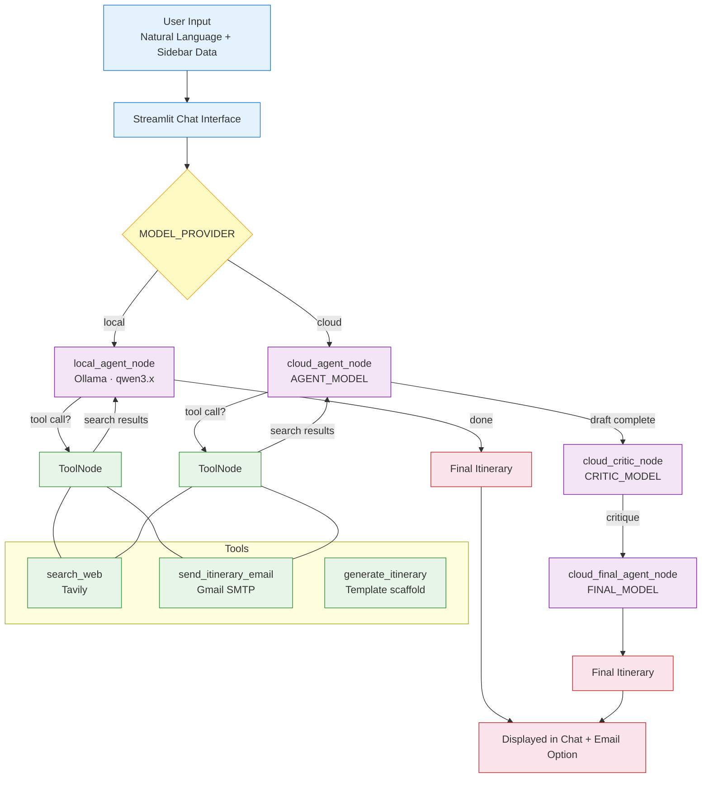

# 🌍 VoyageGT

**Your Intelligent Agentic Travel Planner**

VoyageGT is an AI-powered travel agent that helps you plan trips **anywhere in the world**.  
It uses real-time web search via Tavily, smart reasoning, and a dual-path agentic workflow to create personalized, realistic, and well-organized travel itineraries.

Unlike traditional planners, VoyageGT thinks step-by-step, searches for real businesses, and — when using a cloud model — refines its own draft through a critic-and-revision pipeline before delivering the final result.

---

## ✨ Features

- **Global Trip Planning** — Works for any country or continent
- **Dual-Path Agentic Workflow** — Separate optimized pipelines for local and cloud LLMs
- **Grounded Real-Time Research** — Tavily search finds real restaurants, hotels, and attractions
- **Smart Budgeting** — Per-day cost estimates based on your budget level
- **Natural Conversation** — Chat with the agent like a human travel planner
- **Self-Refining Output** — Cloud path runs a critic + revision step before final delivery
- **Email Delivery** — Send the finished itinerary to your inbox with one click
- **Flexible Model Routing** — Mix and match cloud providers per pipeline step to manage API token limits

---

## 🏗️ System Architecture


### How the two paths differ

| | Local path | Cloud path |
|---|---|---|
| **Nodes** | 1 (`local_agent_node`) | 3 (`agent → critic → final_agent`) |
| **Model** | Single Ollama model | One assignable model per node |
| **Reasoning** | Internal steps via structured prompt | Explicit draft → critique → revision pipeline |
| **Tool access** | `search_web`, `send_itinerary_email` | Same, at agent + final_agent nodes |
| **Why** | Local models perform better with one focused context | Cloud models can reliably track multi-step state |

---

## 🚀 How to Run Locally

### Prerequisites
- Python 3.12+
- [Ollama](https://ollama.com) installed and running with your chosen model (default: `qwen3.6`)
- Tavily API key
- Gmail App Password (for email feature)
- API keys for any cloud providers you intend to use (Google, NVIDIA)

### Setup

1. **Clone the repository**
```bash
   git clone https://github.com/yourusername/voyagegt.git
   cd voyagegt
```

2. **Install dependencies**
```bash
   pip install -r requirements.txt
```

3. **Set up environment variables**

   Create a `.env` file in the root directory:
```env
   TAVILY_API_KEY=tvly-your_actual_key_here
   GMAIL_USER=yourgmail@gmail.com
   GMAIL_APP_PASS=your_app_password_here
   GOOGLE_API_KEY=your_api_key_here
   NVIDIA_API_KEY=your_api_key_here
```

4. **Configure your model provider**

   Open `agent.py` and set the top-level variables:
```python
   MODEL_PROVIDER = "local"   # "local" or "cloud"

   # Local only
   LOCAL_MODEL = "qwen3.6"

   # Cloud only — mix and match freely
   AGENT_MODEL  = "gemini"      # runs research + draft
   CRITIC_MODEL = "gemini"    # runs critique
   FINAL_MODEL  = "kimi"      # writes final itinerary
```

5. **Run the app**
```bash
   streamlit run app.py
```

---

## 📁 Project Structure

```text
voyagegt/
├── app.py              # Streamlit frontend, sidebar, chat loop, email button
├── agent.py            # LangGraph graph, dual-path nodes, model config
├── tools.py            # search_web (Tavily), send_itinerary_email, generate_itinerary
├── requirements.txt
├── .env                # (not committed)
├── .gitignore
└── README.md
```

---

## 🛠️ Tech Stack

| Layer | Technology |
|---|---|
| Frontend | Streamlit |
| Agent framework | LangGraph |
| Local LLM | Ollama (qwen3.6 or any compatible model) |
| Cloud LLMs | Google (Gemini 2.5 Flash Lite), NVIDIA NIM (Kimi K2.5) |
| Grounded search | Tavily (`search_depth="advanced"`) |
| Email | Gmail SMTP via App Password |

---

## 🤝 Contributing

Contributions are welcome! Feel free to open issues or submit pull requests.

## 📄 License

This project is open source under the MIT License.

---

**Made with ❤️ for curious travelers**

If you find VoyageGT useful, please ⭐ the repository!